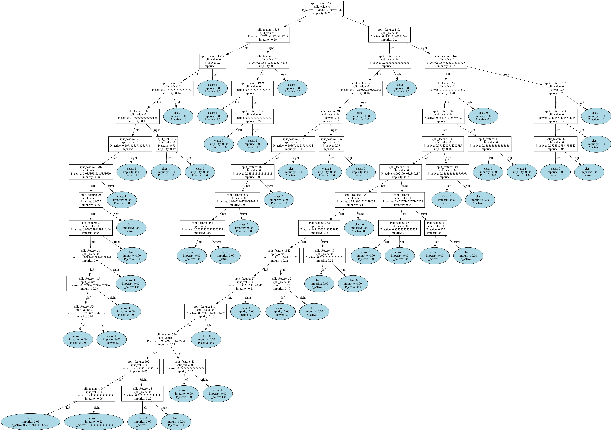

# Topological Impurity measure for Decision Trees and Random Forests for QSAR



## Install poetry
```sh
curl -sSL https://install.python-poetry.org | python3 -
```

# Paste this on your terminal to get started
```sh
# Clone the GitHub repository
git clone https://github.com/Manas02/topologicalimpurity.git
cd topologicalimpurity/

bash setup.sh
```